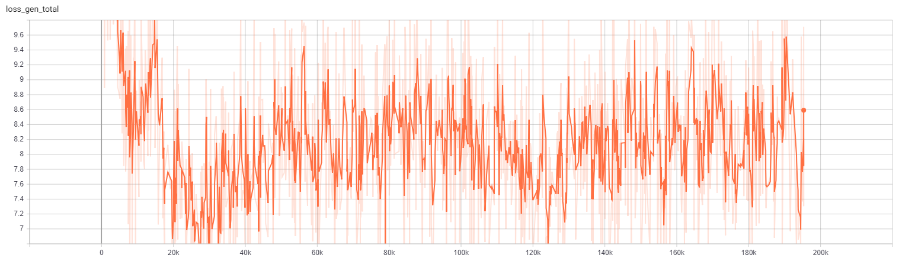
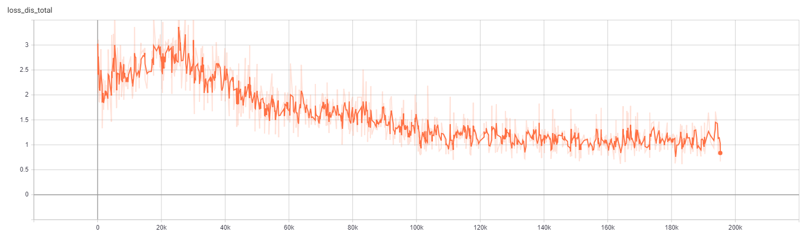

# Homework 2 (Style-Transfer) 
## Training MUNIT
Trained on the summer2winter_yosemite256 dataset. Training time is about 48hrs(200k iteration). Following are the loss training curves:

## Inference one image in multiple style

## Compare with other method
### Neural-style
#### Approach

- Content: 
- Style: 

##### Compare MUNIT with nueral style
-  From the pictures below we can see that the MUNIT preserve the details of content better than the neural-style ones,the reason of that is the higher level of CNN may lost too much pixels only preserves the objects and the arrangement of them,so after the reconstruction the output images would lost a lot of the details
