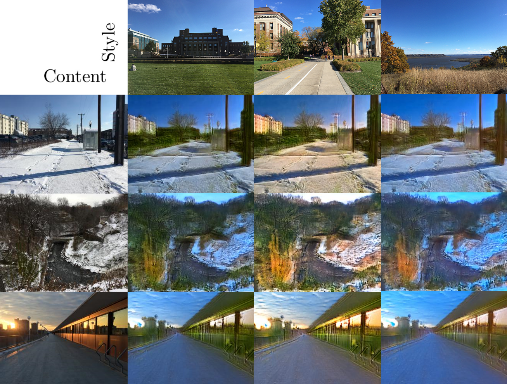
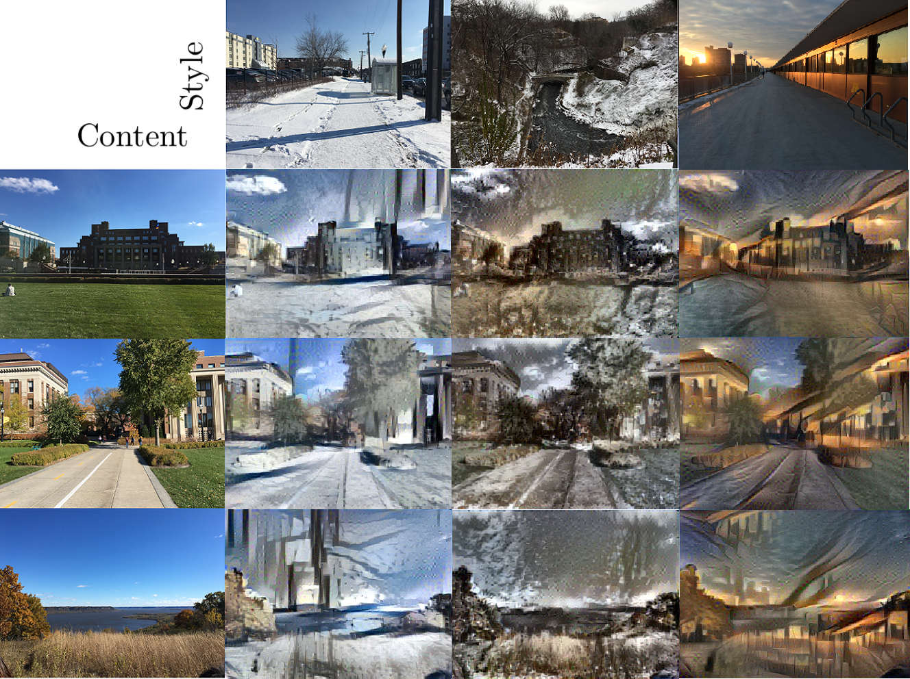
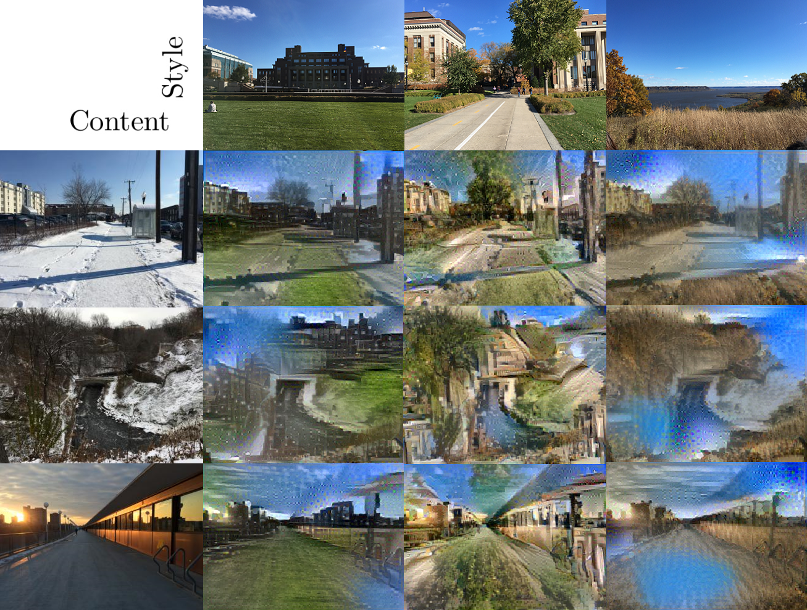

# Homework 2 (Style-Transfer) 
## Training MUNIT
Trained on the summer2winter_yosemite256 dataset. Training time is about 48hrs(200k iterations). Following are the loss training curves:

## Inference one image in multiple style
Here we test the training results using our own photos.

summer to winter:  
  
winter to summer:  
  
We can see that although it can catch the color of the style image, it can not distinguish different object very well. Especially the winter to summer ones. Instead of getting rid of the snow, buildings are truned into green. Summer to winter ones are a bit better, but still not much snow is generated. This may due to the fact that we did not train the models long enough. More training resources and time may lead to better results.
## Compare with other method
### Neural-style
#### Approach

- Content: 
- Style: 

#### Results
summer to winter:  
  
winter to summer:  
  

##### Compare MUNIT with nueral style
-  From the images above, we can see that the MUNIT ones preserves the details of content better than the neural-style ones. The reason is that while higher level of CNN layers can capture the content of the image, it may lost per pixel detail of the original image. So after the reconstruction, the output images only captures the heigh level idea of the content and lost a lot of details.
-  Although we are comparing the summer to winter or vice versa applications of the 2 approaches, it is worth noticing that the origial goal of nueral style is to generate artistic looking works instead of depicting photorealistic images. Images generated via nueral style do look pretty artstic and season changing is more like a side effact apart from the main goal.
