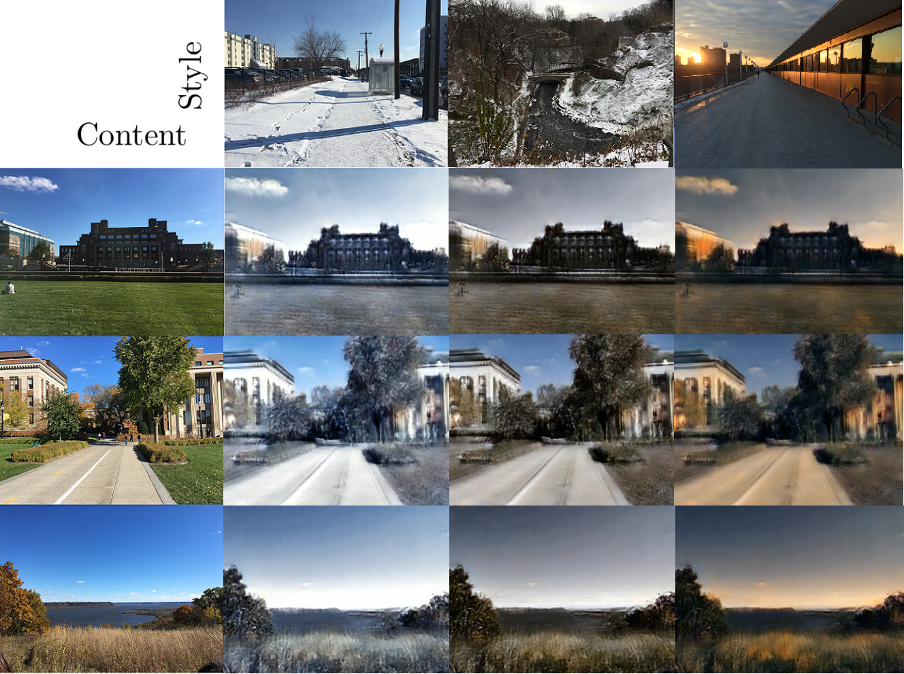

# Homework 2 (Style-Transfer) 
## Training MUNIT
Trained on the summer2winter_yosemite256 dataset. Training time is about 48hrs(200k iterations). Following are the loss training curves:

## Inference one image in multiple style
Here we test the training results using our own photos.

summer to winter:  
  
winter to summer:  
  
We can see that although it can catch the color of the style image, it can not distinguish different object very well. Especially the winter to summer ones. Instead of getting rid of the snow, buildings are truned into green. Summer to winter ones are a bit better, but still not much snow is generated. This may due to the fact that we did not train the models long enough. More training resources and time may lead to better results.
## Compare with other method
### Neural-style
#### Approach

- Content: 
- Style: 

##### Compare MUNIT with nueral style
-  From the pictures below we can see that the MUNIT preserve the details of content better than the neural-style ones,the reason of that is the higher level of CNN may lost too much pixels only preserves the objects and the arrangement of them,so after the reconstruction the output images would lost a lot of the details

